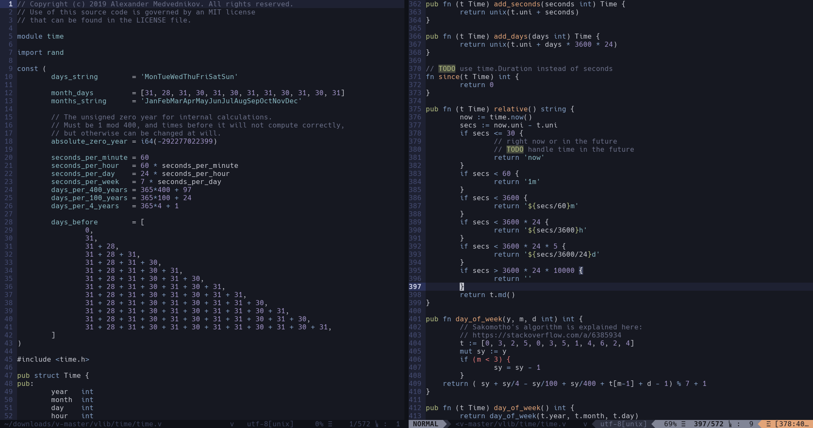

<h1 align="center">vim-v</h1>



<p align="right">
	<sub>
		<em>colorscheme: <a href="https://github.com/cocopon/iceberg.vim">Iceberg</a></em>
		&ensp;|&ensp;
		<em>font: <a href="http://sourcefoundry.org/hack">Hack</a></em>
	</sub>
</p>

## Features

 * Full syntax highlighting
 * Auto-indentation and syntactic folding
 * Optional highlighting of some syntax errors

## Installation

The recommended way of installing plugins is through a plugin manager.

With [dein.vim](https://github.com/Shougo/dein.vim):

```vim
dein#add('cheap-glitch/vim-v')
```

With [vim-plug](https://github.com/junegunn/vim-plug):

```vim
Plug 'cheap-glitch/vim-v'
```

## Usage

### Display warnings for invalid C-like syntax

The syntax of V is very similar to that of C and C-like languages, but there are
nonetheless  some  significant differences.  To  help  you avoid  using  invalid
C-style  syntax out  of habit,  you can  activate the  option to  highlight some
syntax errors by adding this line anywhere in your `.vimrc` or `init.vim`:

```vim
let g:v_warnings = 1
```

## Contributing

Contributions are welcomed! Please open an issue before submitting substantial changes.

## Acknowledgments

The first version of this plugin was based on [v.vim](https://github.com/andreyrmg/v.vim)
by [andreyrmg](https://github.com/andreyrmg).

## License

ISC
